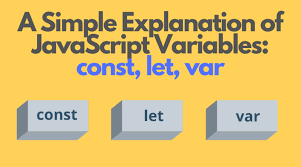

# lecture1-April
# Homework
## _JavaScript_


### JavaScript is the world's most popular programming language.

### JavaScript is the programming language of the Web.

### JavaScript is easy to learn.

### This tutorial will teach you JavaScript from basic to advanced.

----------------------------------------------------------------------------


## _HISTORY OF JAVASCRIPT_


#### *The ECMAScript specification is a standardized specification of a scripting language developed by Brendan Eich of Netscape initially named Mocha, then LiveScript, and finally JavaScript.Learn modern JavaScript from the beginning, but without forgetting the older parts!* 


----------------------------------------------------------------------------


## _Variables_

* #### In programming, a variable is a container (storage area) to hold data.
* #### In Javascript there is two types of intializing variables, `var` and `let`. You can use both of them. However, there are some differences between them.
* #### If you are sure that the value of a variable won't change throughout the program, it's recommended to use  `const`.

----------------------------------------------------------------------------


## _OBJECTS AND PRIMITIVES_


## _Null type_

* #### The `Null` type is inhabited by exactly one value: `null`


## _Undefined type_

* #### The `Undefined` type is inhabited by exactly one value: `undefined`

## _Boolean type_

* #### The `Boolean` type represents a logical entity and is inhabited by two values: `true` and `false`.
* ### `Boolean` values are usually used for conditional operations, including ternary operators, if...else, while, etc.
```
let x = 5;
let y = 5;
let z = 6;
(x == y)       // Returns true
(x == z)       // Returns false
```
## _Strings_

* #### A `string` (or a text string) is a series of characters like "John Doe".

```
// Using double quotes:
let carName1 = "Volvo XC60";

// Using single quotes:
let carName2 = 'Volvo XC60';
```

## _Numbers_

* #### All JavaScript `numbers` are stored as decimal `numbers` (floating point).
```
let x1 = 34.00;

let x2 = 34;
```

## _BigInt_

* #### All JavaScript numbers are stored in a a 64-bit floating-point format.

* #### JavaScript `BigInt` is a new datatype (ES2020) that can be used to store integer values that are too big to be represented by a normal JavaScript Number.

```
let x = BigInt("123456789012345678901234567890");
```

----------------------------------------------------------------------------
### _Operators IN JavaScript_

 

### _JavaScript Arithmetic Operators_


### _LOGICal OPERATORS : AND(&&), OR( | | ), NOT(!)_


### _Comparison operators_


### _ASSIGNMENT operators_


-------------------------------------------------------------------------------------------------------


## _CONDITION If/else statement_

* #### The if/else statement executes a block of code if a specified condition is true. If the condition is false, another block of code can be executed.

```
if (condition1) {
  // block of code to be executed if condition1 is true
} else if (condition2) {
  // block of code to be executed if the condition1 is false and condition2 is true
} else {
  // block of code to be executed if the condition1 is false and condition2 is false
}
```

## _CONDITION Switch statement_

* #### The `switch` statement is used to perform different actions based on different conditions.
* #### Use the `switch` statement to select one of many code blocks to be executed.
* #### The `default` keyword specifies the code to run if there is no case match
* #### When JavaScript reaches a `break` keyword, it breaks out of the switch block.


```
switch(expression) {
  case n:
    code block
    break;
  case n:
    code block
    break;
  default:
    default code block
}
```
------------------------------------------------------------------------------------------------

## _LOOP for_
```
const cars = ["BMW", "Volvo", "Saab", "Ford"];
for (let i = 0; i < cars.length; i++) {
  text += cars[i] + "<br>";
}
```
* #### Loops a code block while a condition is true
*  #### The loop starts in position 0 (`let i = 0`).
*  #### The loop automatically increments `i` for each run.
*  #### The loop runs as long as `i < cars.length`.


## _LOOP while_
```
const cars = ["BMW", "Volvo", "Saab", "Ford"];
let text = "";
let i = 0;
while (i < cars.length) {
  text += cars[i] + "<br>";
  i++;
}
```
* #### Loops a code block while a condition is true
*  #### The loop starts in position 0 (`let i = 0`).
*  #### The loop automatically increments `i` for each run.
*  #### The loop runs as long as `i < cars.length`.


## _LOOP Do/while_
```
do {
  code block to be executed
}
while (condition);
```
* #### The `do...while` statements combo defines a code block to be executed once, and repeated as long as a condition is `true`.
*  #### The `do...while` is used when you want to run a code block at least one time.

------------------------------------------------------------------------------------------------------------

## _Function_


## _FUNCTION Declaration_

* #### The function declaration defines a function with the specified parameters.
* #### A function is declared using the function keyword.


## _Immediately Invoked Function Expression_

* #### An IIFE (Immediately Invoked Function Expression) is a function that runs the moment it is invoked or called in the JavaScript event loop. Having a function that behaves that way can be useful in certain situations. IIFEs prevent pollution of the global JS scope.


## _FUNCTION expression_

* #### The function keyword can be used to define a function inside an `expression`.

* #### You can also define functions using the function `declaration` or the `arrow syntax`.

```
const getRectArea = function(width, height) {
  return width * height;
};

console.log(getRectArea(3, 4));
// Expected output: 12

```